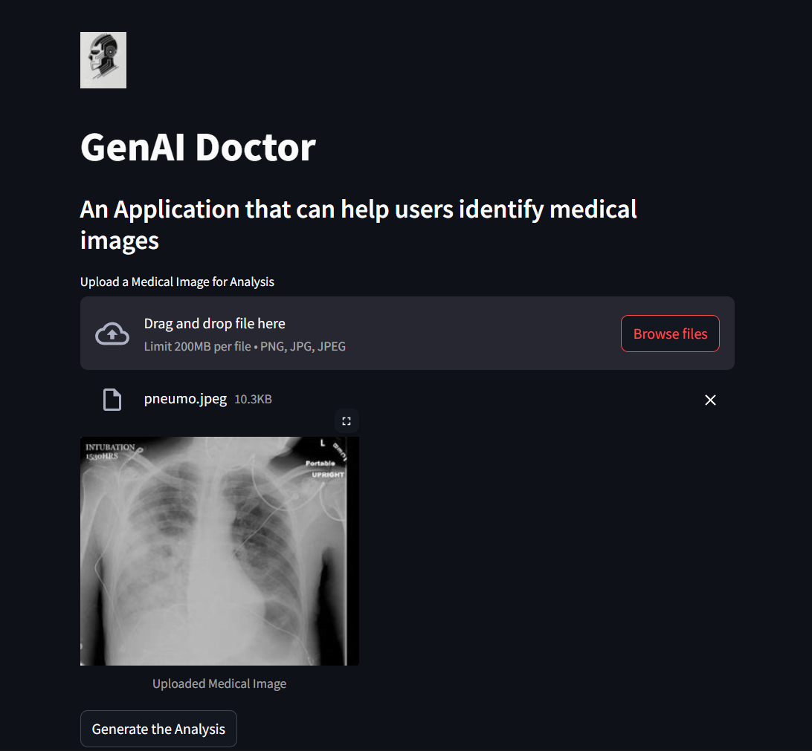
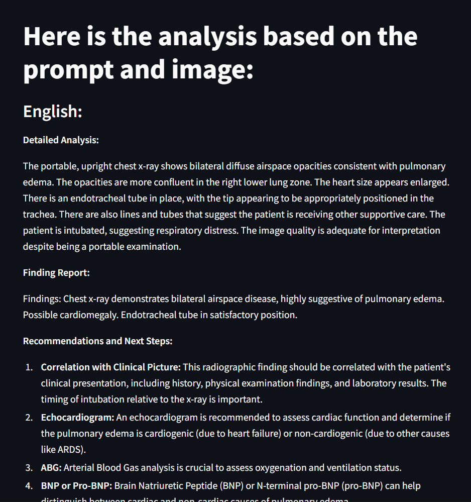
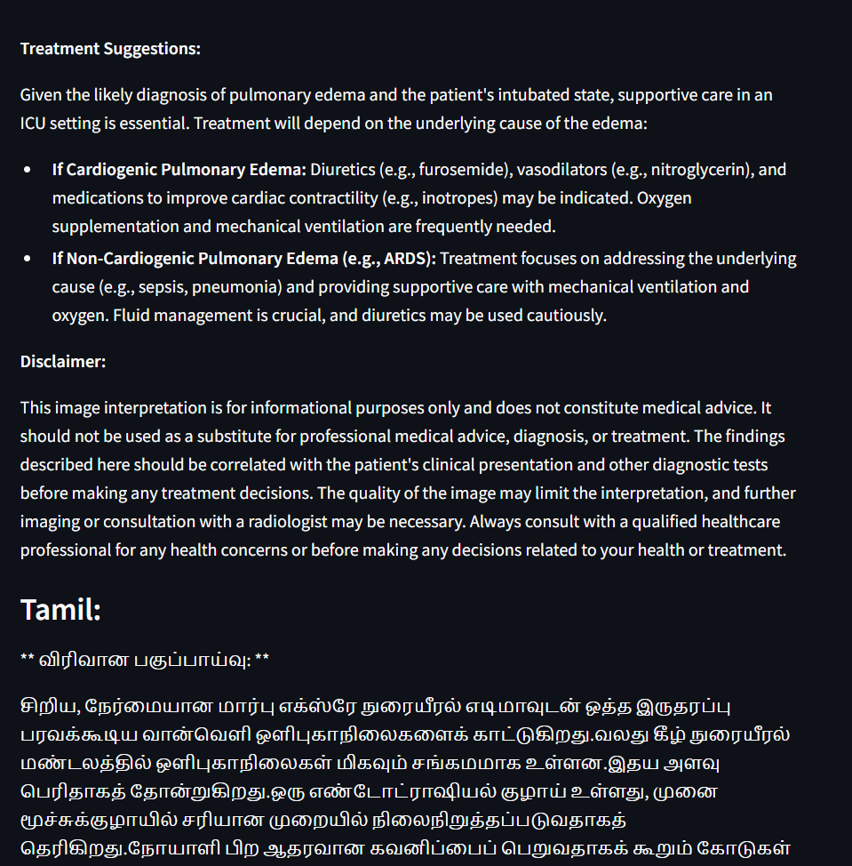
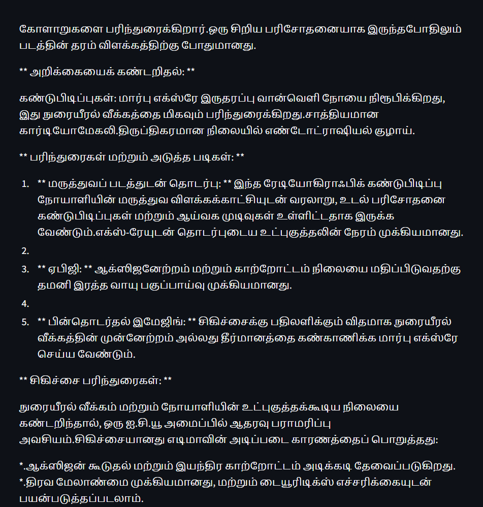

# 🩺 GENAI-MEDICAL-IMAGE-ANALYZER


---

<p align="center">
  
</p>

## 🚀 Overview
The **GenAI Medical Image Analyzer** is an AI-powered web app for analyzing medical images. It leverages **Google Gemini 1.5 Flash** (Generative AI) to generate medical analysis and Google Translate to provide results in both English and Tamil.

---

## ✨ Features

- 📤 **Upload and analyze medical images** (PNG, JPG, JPEG)
- 🤖 **AI-generated analysis and recommendations using Google Gemini 1.5 Flash**
- 🌐 **Results in English and Tamil**
- 🖥️ **User-friendly web interface** (Streamlit)
- 🛡️ **Secure API key management**

---

## 🗂️ Project Structure
```text
GENAI-MEDICAL-IMAGE-ANALYZER/
│
├── app.py              # Main Streamlit app
├── requirements.txt    # Python dependencies
├── api_key.py          # Your (ignored) API key file
├── .gitignore          # Files to ignore in git
├── logo.jpeg           # App logo
├── input/              # Sample input images
├── output/             # Sample output images
└── README.md           # This file
```

---

## 🛠️ Prerequisites
- **Python 3.8+**
- **Libraries:**
  - `streamlit`
  - `google-generativeai`
  - `googletrans==4.0.0-rc1`

---

## ⚡ Installation
1. **Clone the repository:**
   ```bash
   git clone https://github.com/vickii20/genai-medical-image-analyzer.git
   cd genai-medical-image-analyzer
   ```
2. **Install dependencies:**
   ```bash
   pip install -r requirements.txt
   ```
3. **Add your API key:**
   - Copy your Google Generative AI API key into `api_key.py` (see template).

---

## ▶️ Usage
1. **Start the app:**
   ```bash
   streamlit run app.py
   ```
2. **Open your browser:**
   - Go to [http://localhost:8501](http://localhost:8501)
3. **Upload a medical image** and click **"Generate the Analysis"**
4. **View results** in English and Tamil

---

## 🖼️ Example
### Input:
<p align="center">
  
</p>

### Output:
<p align="center">
  
  
  
  
</p>

---

## 🤖 About Gemini 1.5 Flash

This project uses **Gemini 1.5 Flash**, a state-of-the-art, fast, and cost-effective multimodal AI model from Google DeepMind. Gemini Flash enables rapid and accurate analysis of medical images by leveraging advanced generative AI capabilities. For more information, see the [Gemini documentation](https://ai.google.dev/gemini-api/docs).

---

## 🤝 Contributing
We welcome contributions! Please fork the repository and submit a pull request.

---

## 📄 License
This project is licensed under the MIT License. See the [LICENSE](LICENSE) file for details.

---

## 📬 Contact
For questions or support, please contact [vigneshramamoorthy04@gmail.com](mailto:vigneshramamoorthy04@gmail.com).

---

> _Feel free to open an issue in the GitHub repository for bug reports or feature requests!_
